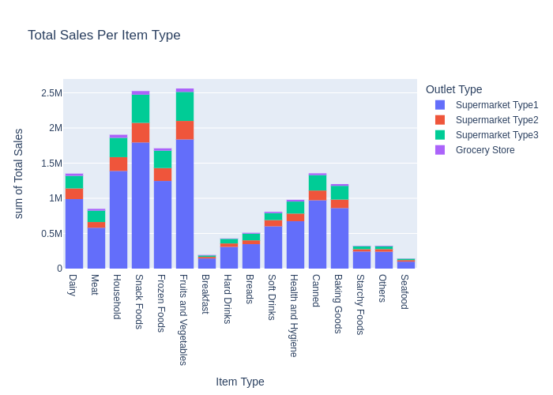
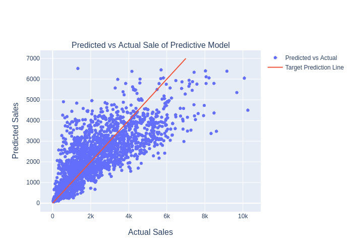

# Bigmart Analysis on Adopting Machine Learning Predictors
## Initial Data Analysis

**Wesley Giles**

### Business problem:

BigMart has been looking for a way to accurately predict their sales across their chain of grocery stores and Super Markets, and has consulted **SeraphDev** to assist them with leveraging Machine Learning to handle this complex business task

### Data:
The dataset for given for evalution had 8523 entries across 10 stores and 16 item classifications, and included data on the total revenue generated from each product, as well as some other useful information such as weight, Maximum Retail Price, and visibility in the store.

## Methods
- Data was explored and cleaned through various methods including imputing missing data and normalizing data into consistent categories
- After the inital data exploration phase, a pipeline for normalizing the data in a similar manner was created and fit
- Finally multiple Machine learning Models were compared against one another to find the one which fits the nededs of BigMart best

## Results

Initial data analysis provided lots of valuable information such as which items are consistently making the most money across stores (Fig 1)

Additionally, after testing multiple models one came out with an acceptable loss amount(MAE of 754.27). It could be used to predict general sales trends for products

#### Total Sales per Item Type

> Trends in sales by item types

#### Visualized accuracy of ML Model

> Precitons vs actuals as compared to target (100% accurate)

## Model

The final model was a dense nueral network implemented using keras and trained with an early stopping callback to prevent overfitting

The MAE for this model is 754.27
The MSE for this model is 1142664.27
The RMSE for this model is 1068.95
The r2 for this model is 0.61

These metrics tell us that total sales for a product can be estimated with an average error of $754 although the higher RMSE informs us that outliers are fairly common and more reasearch should be conducted into trends amongst these outliers

## Recommendations:

My recommendation is that BigMart begins using this model in order to estimate Sales for new products while dedicating funding to reasearch on the outliers and potential causes of this varience in data, in order to produce a higher quality model

## Limitations & Next Steps

This model is a powerful predictive tool, however care must taken in it's implementation, new trends in consumer behavior may cause a higher error than previously seen, and as such current methods of making business decisions should not be replaced by the model. Instead the model shoud be used to support the current structure of business execution.

### For further information

For any additional questions, please contact **Wesley@SeraphDev.com**